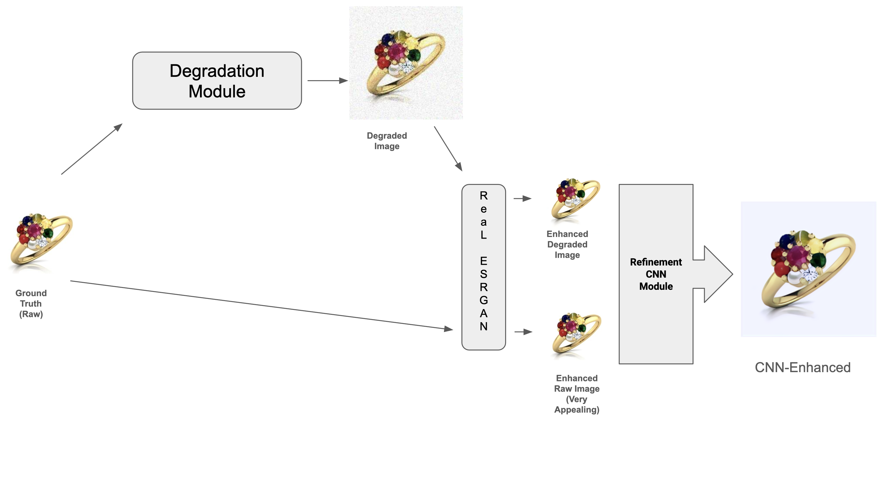
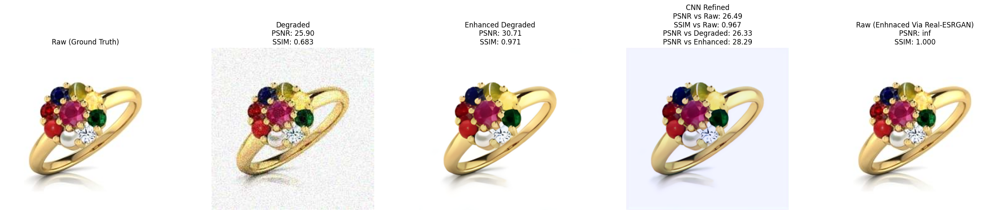
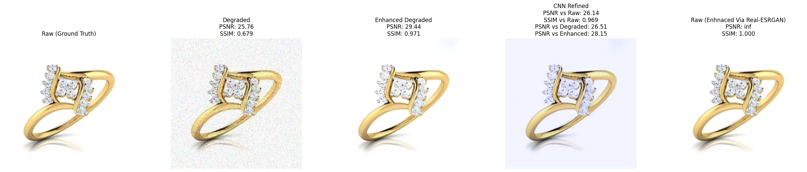
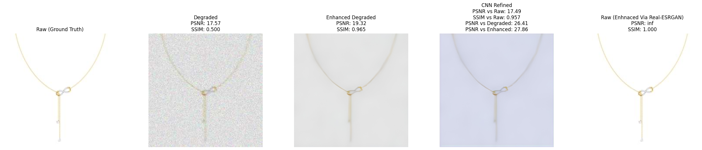
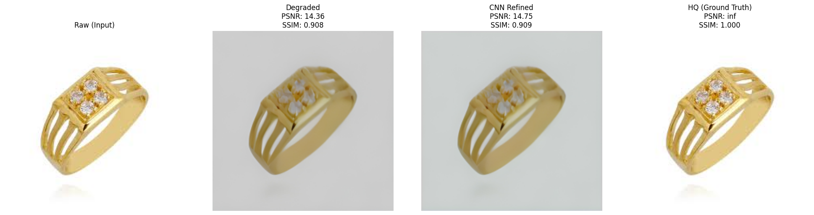

# Jewelry Image Enhancement via Real-ESRGAN and RefinementCNN

**Author:** Tejas Chandrakant Thakare  
**Email:** [tejas.c.thakare@gmail.com](mailto:tejas.c.thakare@gmail.com)

---

## Overview
Jewelry image enhancement pipeline using Real-ESRGAN for super-resolution and a RefinementCNN for fine-tuned color and texture correction.

---

## Stack Used
- Real-ESRGAN (image restoration and super-resolution)
- RefinementCNN (custom CNN for jewelry-specific enhancement)
- Python, PyTorch, Google Colab

---

## Run the Complete Pipeline

To reproduce the results, open and run the full notebook in **Google Colab**:

---

## Architecture

  

<em>The raw image (ground truth) is given to the degradation module, which simulates blur, noise, compression, and other artifacts. The degraded image is then passed through Real-ESRGAN to obtain ESRGAN(degraded). Similarly, the raw image is also processed through Real-ESRGAN to obtain ESRGAN(raw). Both enhanced outputs are then used to train the RefinementCNN module to produce the final CNN-enhanced image. Although ESRGAN(raw) appears the most visually appealing, the CNN-enhanced output achieves better quality than the degraded image.
</em>

---

## Results

  

  

  

In Above, The first image in the row is the raw image, the second is simulated degraded, the third is degraded enhanced via Real-ESRGAN, the fourth is our CNN-Enhanced, and the last one is raw enhanced image via Real-ESRGAN.

  

Here, The first image is the raw input, the second image is the enhanced degraded image, the third is our CNN-refined output, and the last one is the raw enhanced image via Real-ESRGAN.  
Here, the PSNR and SSIM of our CNN-Enhanced output increased by **+0.39 dB** and **+0.001**, respectively, compared to the enhanced degraded image.

---

##  Demo Video

[ Watch Demo Video on Google Drive](https://drive.google.com/file/d/1EJZAwSxPXfeIBZhdxAGJJg8JH8RoOS_2/view?usp=sharing)

